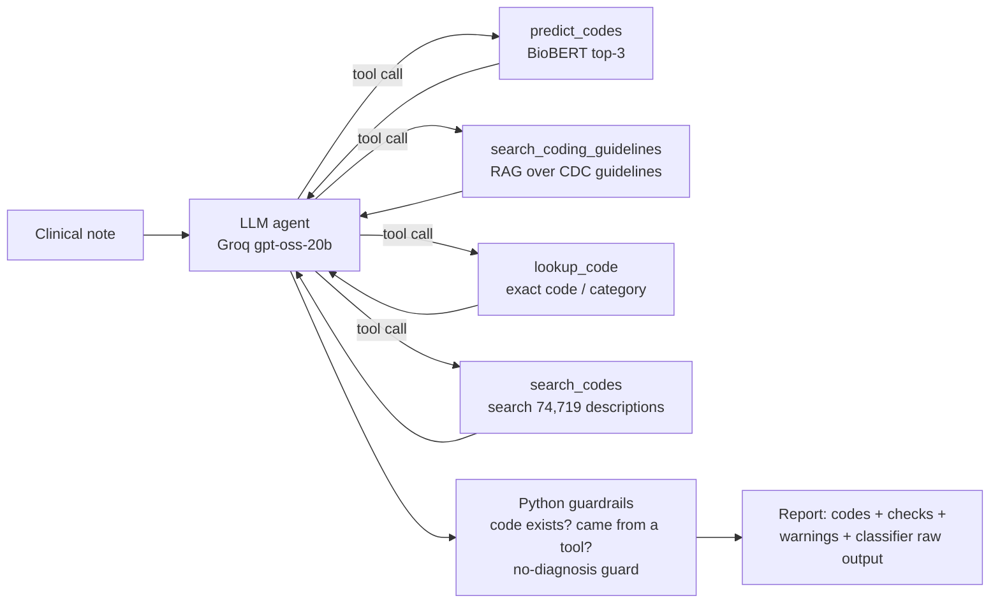

# ICD-10 Coding Assistant: BioBERT Classifier + Guardrailed LLM Agent

Reads a free-text clinical note and suggests **ICD-10-CM diagnosis codes**. Every suggested code is verified against the official code list, and a warning is raised when the system is unsure.

It combines:
- a **BioBERT classifier** fine-tuned on 232 ICD-10 codes,
- a **RAG retriever** over the official CDC *ICD-10-CM Guidelines for Coding and Reporting (FY2026)*,
- a **tool-calling LLM agent** that decides which tool to use, surrounded by **deterministic Python guardrails**.

> ⚠️ Portfolio / research project. Not for real clinical or billing use. All suggestions need human review.

---

## Why this project is interesting

The hard part was **making an LLM trustworthy**, not calling one.

In the first version the agent returned a polished and confident report for *"Flexible sigmoidoscopy. Sigmoid and left colon diverticulosis. Rectal bleeding."* The report was almost entirely wrong:

| | Without guardrails | With guardrails |
|---|---|---|
| Codes | **K63.3** (real meaning: *ulcer of intestine*), **R19.4** (real meaning: *change in bowel habit*) | **K57.31** Diverticulosis of large intestine … with bleeding, verified |
| Confidence | invented 0.96 / 0.94 (classifier said 0.16) | no invented numbers; "not from classifier" + low-confidence warning |
| Citations | invented guideline pages | only pages actually retrieved, or "No specific guideline passage found" |

In a later test the LLM **claimed it had verified a code that does not exist**. The Python check caught it and flagged it for human review.

Main lesson: **a prompt is a request, not a guarantee.** Anything that must always hold is enforced in code.

---

## Architecture



### Pipeline, step by step
1. **Weak labeling (no labeled data existed).** I matched 4,999 real clinical notes (MTSamples) to the 74,719-code ICD-10-CM list with **SapBERT** embeddings and cosine similarity. SapBERT kept **99.8%** of notes; a TF-IDF baseline kept only 75%, because it misses synonyms such as *caries/cavity*.
2. **Classifier.** Fine-tuned **BioBERT** on the 232 codes with at least 5 examples (3,569 notes). Per-class metrics showed a rare-code recall gap, so I trained with **class-weighted loss**: macro recall rose from 0.88 to **0.92** and macro F1 from 0.86 to **0.89** (accuracy 0.87).
3. **Knowledge base (RAG).** I extracted the official FY2026 guidelines PDF (121 pages), removed headers and table-of-contents noise, and split it into 1,000-character page-level chunks with 200-character overlap (365 chunks). The chunks are embedded with **BAAI/bge-small-en-v1.5** and searched with NumPy cosine similarity; a vector DB is unnecessary at this scale. Retrieval was validated with known-answer queries, and an A/B-tested BGE query instruction fixed a ranking error.
4. **Agent.** A custom tool-calling loop (no framework, so every step is visible) with 4 tools, `max_steps`, retries for malformed model output and rate limits, duplicate-call blocking, and a graceful "answer now" finish.
5. **Guardrails.**
   - The system prompt allows only codes that a tool returned, requires real confidences and real citations, and forbids undocumented details.
   - The classifier always receives the *original* note, never the LLM's rewritten version.
   - **Provenance check:** each code in the final answer must be (a) a real billable code and (b) returned by a tool during the run. Otherwise a warning banner is added.
   - **No-diagnosis guard:** very low classifier confidence plus no verified lookup produces "No codable diagnosis found".
6. **Serving.** FastAPI (`/predict` for the classifier only, `/analyze` for the full agent) and a Streamlit review UI.

---

## Repository layout

| File | Purpose |
|---|---|
| `sapbert_label_filter.ipynb` | Stage 1: data exploration + SapBERT weak labeling |
| `train_biobert.ipynb` | Stage 2: BioBERT fine-tuning, class-weighted loss, evaluation |
| `build_knowledge_base.ipynb` | PDF → chunks → embeddings (RAG knowledge base) |
| `agent.ipynb` | Step-by-step development of the agent loop and its guardrails |
| `tools.py` | The 4 agent tools (models and data load once at import) |
| `agent.py` | Agent loop, system prompt, retries, guardrails, `analyze_note()` |
| `main.py` | FastAPI: `POST /predict`, `POST /analyze` |
| `app_agent.py` | Streamlit UI for the agent (`app.py` = classifier-only UI) |
| `run_tests.py` | 12-note regression test suite with expected codes |
| `data/icd_guideline_chunks.json`, `data/icd_guideline_vectors.npy` | Prebuilt RAG knowledge base |
| `data/icd10cm-codes-2026.txt` | Official CDC ICD-10-CM FY2026 code list |

---

## Run locally

```bash
pip install -r requirements.txt
echo "GROQ_API_KEY=your_key_here" > .env        # free key from console.groq.com
uvicorn main:app --reload                       # terminal 1
streamlit run app_agent.py                      # terminal 2
python run_tests.py                             # optional: test suite (~15 min, free-tier rate limits)
```

**Not in this repo** (size or licensing):
- `saved_model/biobert_icd_classifier_weighted/`: the fine-tuned model (~415 MB). Reproduce it with `train_biobert.ipynb`; a hosted copy is planned.
- `data/mtsamples.csv`: [Kaggle Medical Transcriptions dataset](https://www.kaggle.com/datasets/tboyle10/medicaltranscriptions).
- `data/selected_labeled_notes.csv`: generated by `sapbert_label_filter.ipynb`.

---

## Known limitations (honest list)
- Weak labels come from embedding similarity, not human coders, so some training labels are noisy (low-similarity matches were inspected and confirmed).
- The classifier covers only 232 codes and is weak on short, informal notes (it was trained on long transcriptions). The agent compensates with code search across all 74,719 codes.
- LLM output varies between runs, so the deterministic checks are the safety net, not the prompt.
- Deep 7-character injury codes (e.g. meniscus tears, sprains with laterality) were the hardest cases; the `search_codes` tool was added specifically for them.

## Tech
Python · PyTorch · Hugging Face Transformers (BioBERT, SapBERT) · sentence-transformers (BGE) · scikit-learn · NumPy · Groq API (gpt-oss-20b) · FastAPI · Streamlit · Docker
